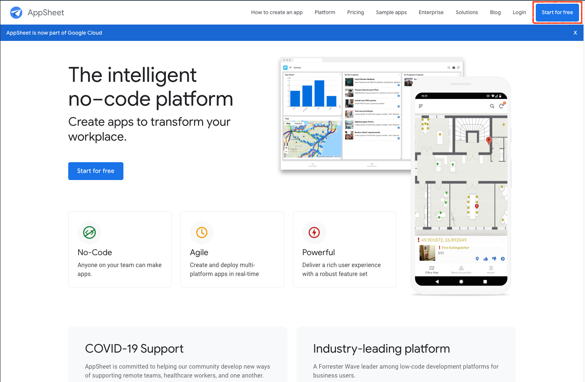
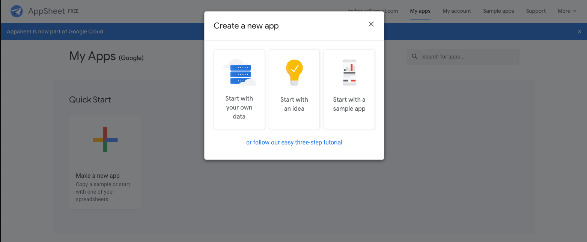
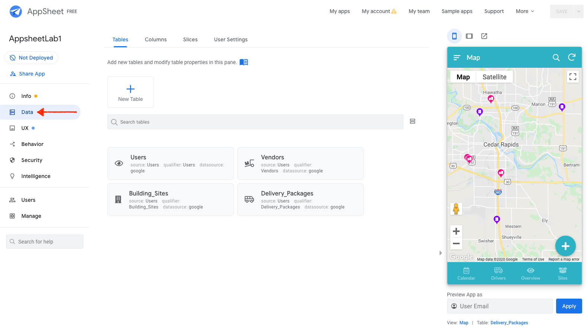
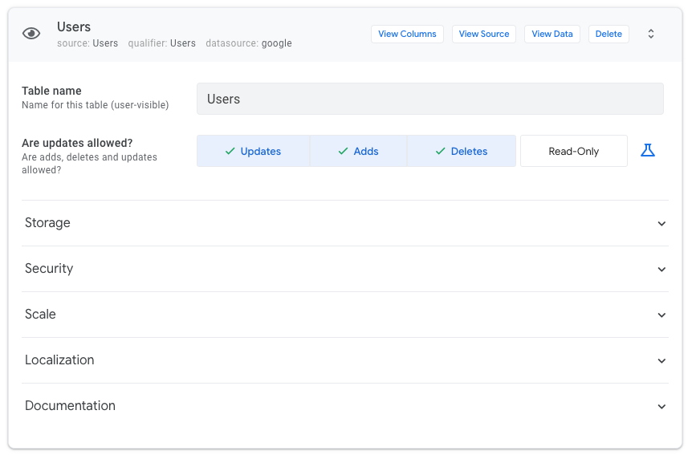
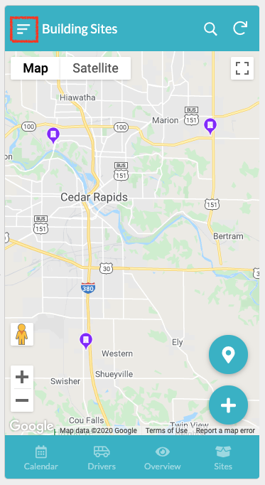

Pre-requisites: 
1) A Google Account

## Login into Appsheet
1. Login into http://appsheet.com
1. Click on Login and Select Google as your best way to sign in.

1. Select the Google Account you would like to use for this Lab
1. Allow permissuons to access Google resources on it's behalf. After this lab you can revoke these permissions if needed. Click allow.
1. In this screen you will see different settings of your account. From allowed sources you have added to integration with third party auth, data stores or Channels, to billing information.

## Create an app
1. Do click under My Apps. An overlay frame will allow you to choose between "Start with your data", "Start with an idea" or "Start with a sample app". During this short lab, we will explore a sample app. Click "Start with a sample app".

1. Select a name for your app. In this case we will use  ```AppsheetLab1```. Under categories, select Logistics. Select *Shipment Tracking* as the sample app to deploy.
1. Waiting until the new app is set up.
1. Close the pop-up informational help tool.

## Exploring the Appsheet interface

Appsheet divides its interface in 4 main locations:

1. Top bar menu: Here we can go back to the main Appsheet webpage, review our team's work, explore more sample apps, connect with support and go into settings for our own account.
1. Left navigation bar: We will explore this bar during the lab. It has information about the data we are connecting with, the interfaces we will use in our app, workgflows and behaviors, security settings or special features like intelligence. Also we can manage access to our apps and further settigns of our current application.
1. Right live preview app: Every change we make in the app will be reflected in this fully functional app in the right. If we make a change in the interface, the change will be automatically reflected in the preview so we can continuesly acknlogede all the changes we might want to do.
1. Main panel: Here is where we will perform most of the changes once we select the different options of in the left navigation bar.

## Exploring the source of data.
### Tables and Columns

Tables are comprised of columns, which identify the different components of each record. A record is a row of data in your spreadsheet. For instance, a table of addresses would have a column each for street number, street name, city, state, and zip code. Rows contain the data for each individual piece. For the address example, each address would have its own row.


1. Under the Left navigation bar, click under Data.

We now see 4 different Table: Users, Vendors, Building_Sites and Delivery_Packages. Click on Users.

1. Under the different tabs, we can see Storage, Security, Scale, Localization and Documentation. 
- The first one, Storage, gives us information about the source of the data, in this case, Google Sheets. 
- The second one, Security, gives us Security measures to prevent information to be shown in the application or restict visibility of the table depending of the role of the user accessing the app.
- The third one, Scale, gives us the possiblity of source the data under different worksheets (with Business Plan).
- Localization, the forth one, identifies the locale or langague the worksheet is. This will help autodetecting fields and columns.
- Documentation, the last one, let's you comment this table for other collaborators to better align with the content of the same.

2. Click in *View Source*. This will open a new tab in your browser with the worksheet you are using as the main data source of your application. Explore the different tabs and fields to see the different intents of the application.

1. Go back to Appsheet and, just besides *Vew Source*, click on View Columns. This will the main panel with information abou the Columns and how did Appsheet interpretated the worksheet fields. If we click on each of the edit icons of each field, we open a contextual menu with more information to change about these fields. In this example click on the edit button of *User_Name*. 
1.We want to change the display name of this field. For that, we will scroll to the Display bar and click to open the menu. Let's change the display name of this field to ```Name```. Click on the text box and the *Expression Assistant* will open. Get familiarized with this Expression Assistant since it is a poweful tool to create conditions, expressions, deep links and auto-generate values in many of the contexts of Appsheet. Write ```Name``` in the text box. Click Save and then Done.

1. To see the changes reflected on our preview application we need to save the application. Click on the Save button, top right corner of the Top bar menu.

1. Now, in the application, click in the menu to display the different data sources added to the app. The click on ```Users```. 


    Select one of the users by clicking on it. As you can see, the Name field has a display customization. 

    
1. One last thing to notice in this brief lab, is the reference columns. In this case, the last 3 of this table: *Related Building_Sites*, *Related Delivery_Packages* and *Related Building_Sites By Site_Contact*. These 3 fields are a relation between tables. If we click on the Foruma text field, the *Expression Assistant* will show up and we can see how to reference columns to other rows in different tables. In this case, the vale of *Site_Admin* must be equal to *UserId*, which is a **Key** field in this Table.

Take quick look at the table *Delivery_Packages* as we did for *Users*. Review its columns as well. Notice the different Formulas and the Show field where we decide if we show the field based out of the content of the same.

### Slices

When you show the contents of a table in your app, you do not need to show every row, every column, and every action. Instead, you can "slice" the data, choosing a subset of the columns, actions, and rows. A slice is a subset of the rows, columns, and actions of a table.

1. Go to the *Slices* menu under In this case, select *Delivered*. Notice that this slice has a condition: ```[Package_Status]=Delivered```. This condition provides a row filter (show/not show). Ig the *Package_Status* has the value *Delivered*, then the row will be show in the slice. If not, the row will be hide.
1. Under *Slice Columns*, we can select all the columns or just select those columns that we want to show in this slice. You can remove *Driver Name* by clicking the trash bin icon at the right of this column. 
1. Within the app, click on *Overview*. Scroll down until Delivered and select one of the delivered packages.

    

    You should be able to see that all the Driver's name is not present any more. Test a few fields and, at any time, if you want to recover the fields into the slice, click under the + button. 

    

## Exploring views

Let's focus now on views. Views allow you to control how, when, and where data is presented to the app user, and how the user interacts with the data.


